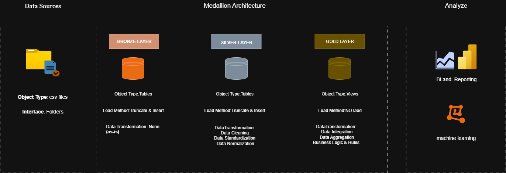
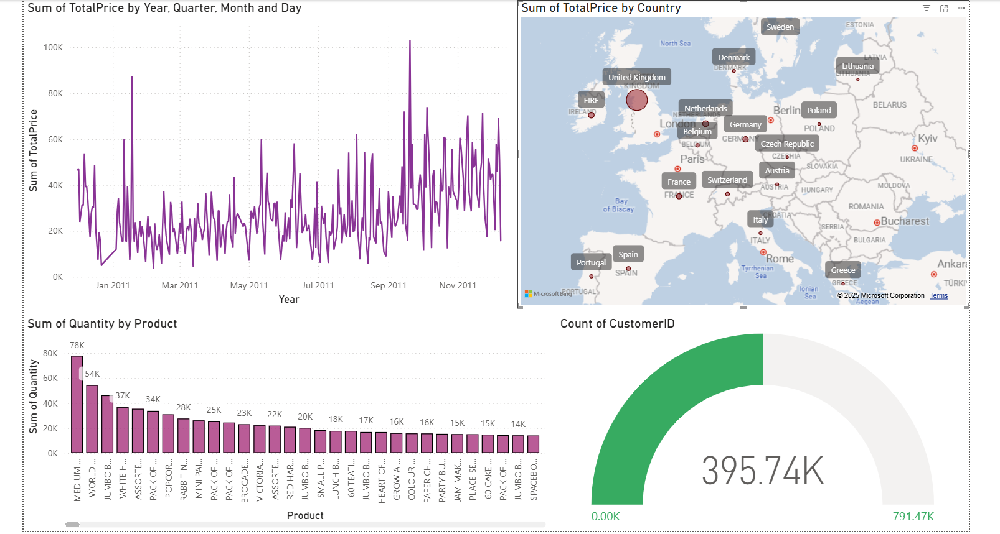

## **Part 1: Project Overview**

# End-to-End Retail Data Warehouse with ETL and BI Analytics

This project demonstrates a full **Data Warehouse pipeline** using a sample Online Retail dataset.  
It implements the classic **Bronze → Silver → Gold architecture** with **ETL processes**, data cleaning, and dimensional modeling for analytics.

### Key Features:
- **Bronze Layer:** Raw CSV data ingestion using `BULK INSERT`.
- **Silver Layer:** Data cleaning and null value handling.
- **Gold Layer:** Star Schema modeling with **fact** and **dimension** tables.
- **Automation:** Stored procedures for ETL execution.
- **Analytics Ready:** Views for easy integration with BI tools like Power BI or Tableau.

### Dataset:
- Source: [Online Retail Dataset](https://archive.ics.uci.edu/ml/datasets/online+retail)
- Columns: InvoiceNo, StockCode, Description, Quantity, InvoiceDate, UnitPrice, CustomerID, Country


## **Part 2: Architecture & Data Flow**


## Architecture

The project follows a layered **Data Warehouse design**:

1. **Bronze Layer (Raw Ingestion)**
   - Store raw CSV data into SQL tables.
   - Minimal transformations.
   - Acts as a single source of truth for incoming data.

2. **Silver Layer (Cleansed Data)**
   - Handle nulls, remove inconsistencies.
   - Convert data types for further processing.
   - Output is ready for dimensional modeling.

3. **Gold Layer (Analytics / Star Schema)**
   - Fact table: `factSales`
   - Dimension tables: `dimCustomer`, `dimProduct`, `dimDate`
   - Enables fast analytical queries.
   - Optional Views created for reporting.

### Data Flow Diagram (Conceptual)


CSV → Bronze → Silver → Gold → Analytics/BI




### Analytics/BI



---

## **Part 3: Usage & Execution**

## How to Run

### Step 1: Load Bronze Layer
```sql
EXEC bronze.load_bronze;
````

### Step 2: Load Silver Layer

```sql
EXEC silver.load_silver;
```

### Step 3: Load Gold Layer

```sql
EXEC gold.load_gold;
```

### Step 4: Query Data

* Example: Total sales per country

```sql
SELECT Country, SUM(TotalPrice) AS TotalSales
FROM gold.vw_SalesStar
GROUP BY Country;
```

### Notes:

* Ensure CSV files are in the correct path with proper encoding (UTF-8).
* Check `StockCode` availability; the ETL dynamically adapts if missing.
* Views (`vw_SalesStar`) simplify querying and BI integration.

